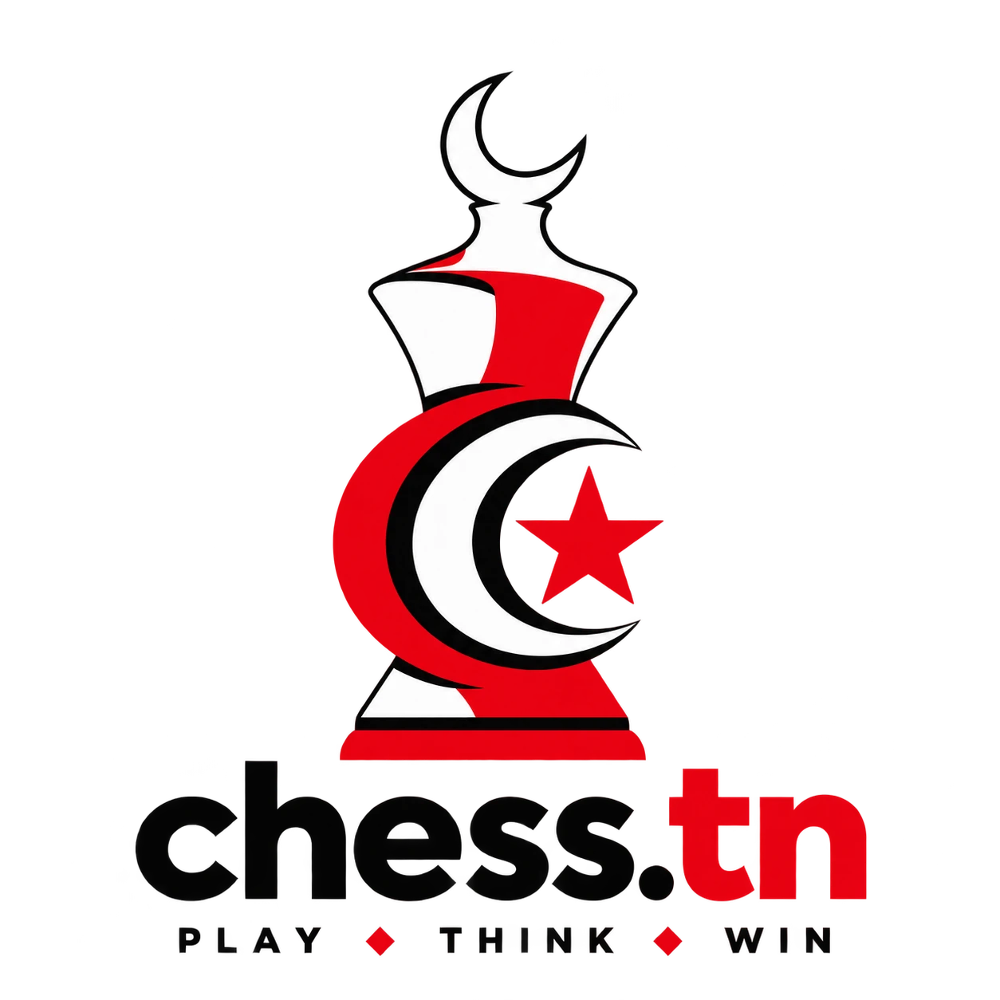
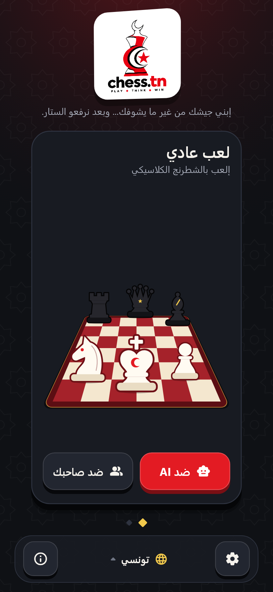
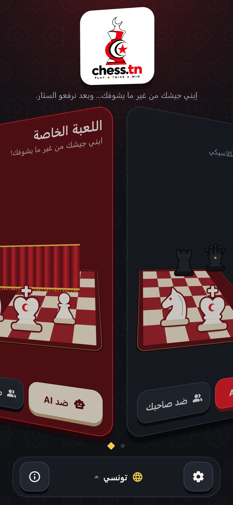
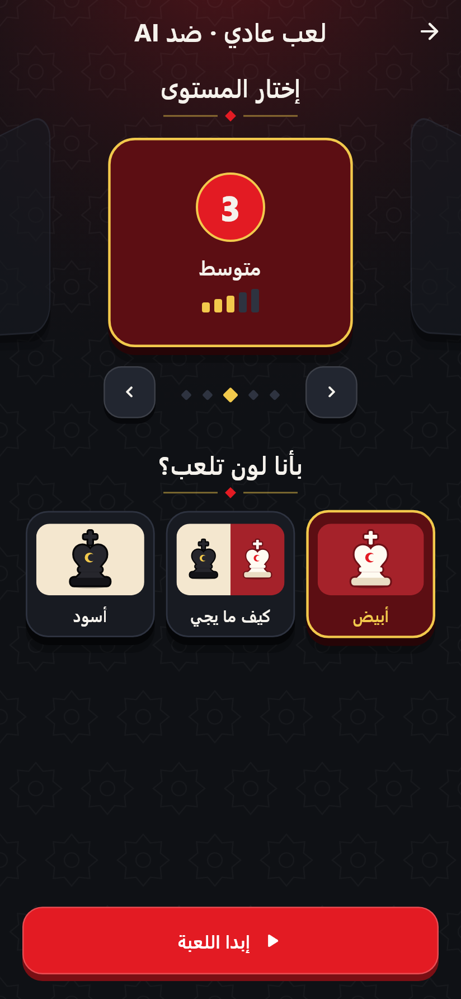
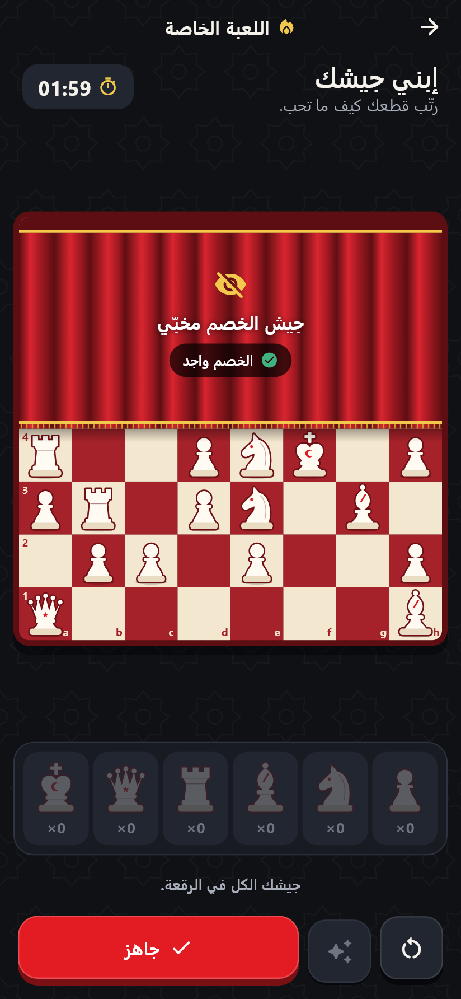
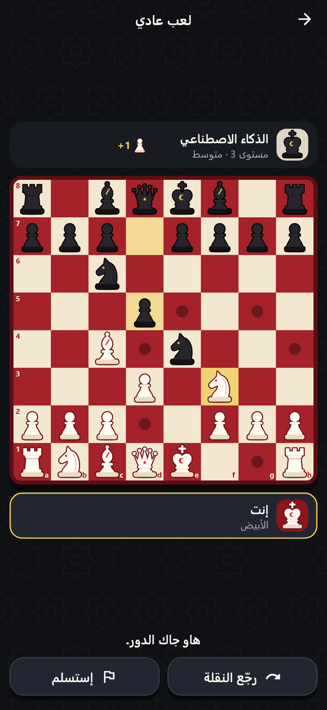

# chess.tn

<p align="center">
  
</p>

**A Tunisian chess game with classic chess and a unique hidden-army Special Mode.**

Developed by **Iheb El Ech** · Made in Tunisia

chess.tn is a mobile chess game (Flutter, Android first, iOS-ready). It speaks
Tunisian Arabic (Darija) by default, works with no account and no internet,
and adds a mode you will not find in other chess apps: both players build
their army in secret, then the curtain opens.

> إبني جيشك من غير ما يشوفك... وبعد نرفعو الستار.

## Screenshots

| Home | Swiping modes | Match settings | Special setup | Battle |
| --- | --- | --- | --- | --- |
|  |  |  |  |  |

The pictures are rendered from the real widgets by
`flutter test tool/screenshots_test.dart`.

## Look and feel

Tunisian red, cream and gold on a dark table, and controls you can feel:
buttons and cards stand on a solid edge and sink under the finger, the two
game modes and the five AI levels are cards you swipe through in 3D, screens
swing in like a door, and the board rises from the table when a game starts.
The reusable pieces are in `lib/core/widgets/` (`game_button.dart`,
`tilt_carousel.dart`) and `lib/core/theme/tilt_page_transition.dart`.

## Game modes

| | vs AI | vs a friend |
| --- | --- | --- |
| **Classic chess** | 5 levels, offline | Same Wi-Fi (LAN) or the same phone |
| **Special chess** | The AI builds its own hidden army | Same Wi-Fi (LAN) or the same phone |

### Classic chess

Standard rules, all of them: check, checkmate, stalemate, castling, en
passant, promotion, threefold repetition, the fifty-move rule and
insufficient material. Tap-to-move or drag and drop, legal-move hints, last
move and check highlights, take-back against the AI.

### Special Mode

1. **Private setup.** Each player gets a normal army (1 king, 1 queen,
   2 rooks, 2 bishops, 2 knights, 8 pawns) and places it freely on their own
   four ranks. The other half of the board is behind a red curtain. A timer
   runs (2 minutes); when it ends, the remaining pieces are placed for you.
2. **Both ready.** Nobody can change anything anymore.
3. **Countdown.** 3 · 2 · 1.
4. **Reveal.** The curtain opens and both armies appear at the same moment.
5. **Battle.** Normal chess from that custom position.

Setup rules:

- Exactly one full army, all sixteen pieces placed, none outside your zone.
- Pawns cannot stand on your own back rank (it is not a legal chess
  position).
- Castling exists only if king and rook stand on their classical squares.
- **No king starts under fire.** Armies are built blind, so a king can be
  attacked the instant the curtain opens. In that case its owner moves it to
  a safe square of their zone before the battle starts. This happens after
  the reveal, when everything is public.

#### How the armies stay secret

- The opponent's pieces are never part of what the screen is given during
  setup — only "ready / not ready" and a piece count.
- **Against the AI**, the AI's army is generated before you place a single
  piece, from nothing but its own colour and level.
- **On the same phone**, a hand-over screen separates the two setups.
- **Over Wi-Fi**, the phones use a commit–reveal exchange: "ready" sends only
  a SHA-256 hash of the army. The real positions cross the network after
  both players are locked, and each phone checks them against the hash. No
  phone — not even the host — can peek early or swap its army afterwards.

## AI

| Level | Name | Engine |
| --- | --- | --- |
| 1 | Very easy | Built-in engine, shallow, often plays a random move |
| 2 | Easy | Built-in engine, depth 2, some noise |
| 3 | Medium | Stockfish, skill 3 |
| 4 | Hard | Stockfish, skill 10 |
| 5 | Expert | Stockfish, skill 20 |

Stockfish 19 runs natively on the device through
[multistockfish](https://pub.dev/packages/multistockfish); nothing is sent to
a server. Levels 1–2 use a small Dart engine on purpose (Stockfish's weakest
setting is still too strong for beginners), and that engine also takes over
if Stockfish cannot start. Each level sets search depth, thinking time, skill
and randomness (`lib/features/ai/domain/ai_level.dart`).

In Special Mode the AI also builds an army: it generates candidates in
several styles (defensive, balanced, aggressive, tricky), scores them for
king safety, pawn structure, piece activity, centre control and exposure,
and stronger levels compare more candidates and refine the best one.

## Playing with a friend on the same Wi-Fi

1. Player A: **Create a game** → a code such as `TN-7K92` appears.
2. Player B: **Join a game** → type the code (or pick the game from the list
   of games found on the network, or enter the host's IP).
3. Both tap **I'm ready**.

No internet and no server: the host phone runs a small WebSocket server and
the other phone connects to it. The code itself carries the host's address on
the local network. The host validates every move (turn, piece ownership,
legality); the joining phone re-checks what the host sends. If the connection
drops, the game pauses and the phones try to reconnect.

## Languages

Tunisian Arabic / Darija (default), English, French. Every string lives in
`lib/l10n/app_*.arb`; the language can be changed from the home screen or the
settings and is remembered.

## Run and build

Requirements: Flutter 3.47+ and the Android SDK.

```bash
flutter pub get
flutter run
```

```bash
flutter build apk --release
```

The APK is written to `build/app/outputs/flutter-apk/app-release.apk`. The
release build is signed with the debug key until you add your own signing
configuration in `android/app/build.gradle.kts`.

## Tests

```bash
flutter analyze
flutter test
```

The suite covers the chess rules, the Special setup rules, the match state
machine, the AI, hidden-information guarantees (including what travels on
the wire before the reveal), the LAN protocol over real sockets, and the
main screens driven through the UI.

## Project layout

```
lib/
  core/            brand, developer links, theme, audio, shared widgets
  l10n/            Darija, English and French strings
  features/
    home/          splash, home, new-game sheet
    chess/         rules wrapper, referee and phases, sessions, board UI
    special_mode/  army placement, validation, commit–reveal, curtain UI
    ai/            levels, Stockfish and built-in engines, AI army builder
    multiplayer/   typed messages, LAN host/client, lobby screens
    settings/      preferences
    about/         About chess.tn, contact, bug report
tool/              brand assets, sounds and screenshots generators
```

State management is Riverpod. One referee class (`MatchAuthority`) owns the
rules and the phase state machine for every kind of game.

## Brand assets

`assets/branding/chess_tn_logo.png` is the official chess.tn logo and the
only source for brand images. The launcher icon and splash images are cut
from it (never redrawn) by:

```bash
dart run tool/build_brand_assets.dart
dart run flutter_launcher_icons
dart run flutter_native_splash:create
```

## Privacy

chess.tn collects nothing: no account, no analytics, no tracking. Contact
buttons only open your own email app or browser, and nothing is sent unless
you send it.

## Developer

**Iheb El Ech**

Found a bug, have an idea or a suggestion? Get in touch:

- Email: [ihebelleuch6@gmail.com](mailto:ihebelleuch6@gmail.com)
- GitHub: [ElEchIheb](https://github.com/ElEchIheb/)
- LinkedIn: [iheb-el-ech](https://www.linkedin.com/in/iheb-el-ech)
- Instagram: [elechiheb](https://www.instagram.com/elechiheb/)
- Facebook: [DangerNoob1920](https://www.facebook.com/DangerNoob1920)

The same links are in the app under **Settings → About chess.tn**.

## Third-party licences

chess.tn uses [Stockfish](https://stockfishchess.org) and
[dartchess](https://pub.dev/packages/dartchess), both licensed under the
GPL-3.0. Distributing the app means complying with that licence, which
includes making the source code of the app available under compatible terms.

© 2026 Iheb El Ech
